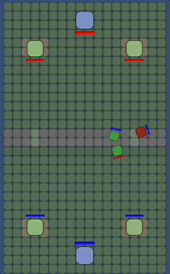

# Royale
A experiment on a card battle game like clash royale in Unity. The moving characters spawned in respective player territory will charge against the nearest enemy and start attcking them by reducing their health. The tower cannot move, but it can attack the enemy character in its close visinity. The player input (spawning of characters) is automated and the tower health is very high as of now to have very long playtime before the game ends.

# Code Overview
The code uses a command design pattern to queue and execute different actions a character can take. It also used prefabs for spawning characters and scriptable objects to assign data. It uses a memory pool system to avoid re-instantiating the same character again if there was one destroyed previously.

The map is broken down into small nodes to make the navigation easy. The nodes are represented in a graph data structure. The nearest enemy is found using breadth first search. A-star algorithm and blocked nodes are in wip. A heap data stucture was built from scratch to enable the a-star path finding. 

